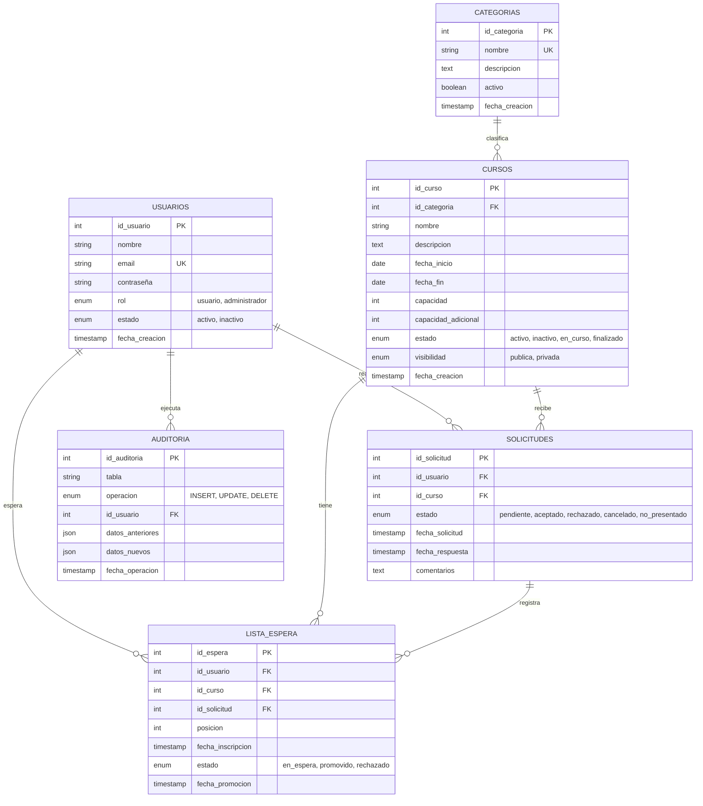

# Diagrama ER - CourseFlow

Este documento contiene el diagrama Mermaid del modelo entidad-relación.

## Diagrama Entidad-Relación



## Descripción del Diagrama

- **PK** = Primary Key (Clave Primaria)
- **FK** = Foreign Key (Clave Foránea)
- **UK** = Unique Key (Clave Única)

### Relaciones:

1. **USUARIOS → SOLICITUDES** (1:N)
   - Un usuario realiza múltiples solicitudes de inscripción
   - ON DELETE CASCADE

2. **CURSOS → SOLICITUDES** (1:N)
   - Un curso recibe múltiples solicitudes
   - ON DELETE CASCADE

3. **USUARIOS → LISTA_ESPERA** (1:N)
   - Un usuario puede estar en lista de espera de múltiples cursos
   - ON DELETE CASCADE

4. **CURSOS → LISTA_ESPERA** (1:N)
   - Un curso tiene una lista de espera de múltiples usuarios
   - ON DELETE CASCADE

5. **SOLICITUDES → LISTA_ESPERA** (1:N)
   - Una solicitud registra un candidato en lista de espera
   - ON DELETE CASCADE

6. **CATEGORIAS → CURSOS** (1:N)
    - Una categoría agrupa múltiples cursos
    - ON DELETE RESTRICT

7. **USUARIOS → AUDITORIA** (1:N)
   - Un usuario ejecuta múltiples operaciones auditadas
   - ON DELETE SET NULL

---

## Flujo de Datos Principal

```
┌─────────────────────────────────────────────────────────────┐
│                    USUARIO (frontend)                        │
└────────┬──────────────────────────────────────────────┬──────┘
         │                                              │
         │ 1. Buscar cursos por categoría               │ 2. Ver mis solicitudes
         ▼                                              ▼
    ┌─────────────────────────────────────────────────────────┐
    │           API REST (BACKEND)                            │
    │  - GET /cursos?categoria_id=1                           │
    │  - GET /categorias                                      │
    │  - POST /solicitudes                                    │
    │  - GET /mis-solicitudes                                 │
    └──────────┬──────────────────────────────────────┬───────┘
               │                                      │
               │ Inserta                              │ Consulta
               ▼                                      ▼
        ┌──────────────┐                    ┌──────────────────┐
        │  SOLICITUDES │◄────────────────┐  │     USUARIOS     │
        │              │                 │  │                  │
        │ estado:      │                 └──┤ Autenticación    │
        │ 'pendiente'  │                    │ Roles y permisos  │
        └──────┬───────┘                    └──────────────────┘
               │
               │ 3. Admin revisa
               ▼
        ┌──────────────────┐
        │   AUDITORIA      │ Registra operaciones
        └──────────────────┘
               
        ┌─────────────────────────────────────────┐
        │     ¿Hay capacidad disponible?          │
        └────────────┬──────────────────┬─────────┘
                     │                  │
                  SÍ │                  │ NO
                     ▼                  ▼
        ┌──────────────────┐  ┌──────────────────┐
        │   SOLICITUDES    │  │  LISTA_ESPERA    │
        │ estado:'aceptado'│  │ posicion: N      │
        └──────────────────┘  │ estado:'en_espera│
                              └──────────────────┘

        ┌─────────────────────────────────────────┐
        │     Cuando hay baja de un usuario       │
        └────────────┬──────────────────┬─────────┘
                     │                  │
              Verificar               Promover
                lista                primero de
               de espera             la lista
                     │                  │
                     └──────┬───────────┘
                            ▼
                ┌─────────────────────────┐
                │ Actualizar SOLICITUDES  │
                │ estado:'aceptado'       │
                │ Actualizar LISTA_ESPERA │
                │ estado:'promovido'      │
                │ fecha_promocion:NOW()   │
                └─────────────────────────┘
                            │
                     Reordenar posiciones
                            │
                            ▼
                ┌─────────────────────────┐
                │  Notificar al usuario   │
                │   (implementar)         │
                └─────────────────────────┘
```

---

## Estados de Solicitud

```
                    ┌─────────────────────────────────┐
                    │      CREAR SOLICITUD            │
                    │   (estado = 'pendiente')        │
                    └──────────────┬──────────────────┘
                                   │
                    ┌──────────────┴──────────────────┐
                    │ Admin revisa solicitud          │
                    └──────────────┬──────────────────┘
                                   │
        ┌──────────────────────────┼──────────────────────────────┐
        │                          │                              │
        │ Hay capacidad            │ No hay capacidad             │
        │                          │                              │
        ▼                          ▼                              │
    ┌────────────────┐        ┌────────────────────┐            │
    │   ACEPTADO     │        │  LISTA_ESPERA      │            │
    │(entra en curso)│        │(posicion_espera=N) │            │
    └────────┬───────┘        └────────┬───────────┘            │
             │                         │                         │
             │                         │ Baja otro usuario       │
             │                         │                         │
             │                         ▼                         │
             │                  ┌─────────────────────┐          │
             │                  │  PROMOVIDO          │          │
             │                  │(entra en curso)     │          │
             │                  └─────────────────────┘          │
             │                         │                         │
             │         ┌───────────────┘                         │
             │         │                                         │
             ├─────────┤                                         │
             │         │                                         │
             │    Cancela inscripción                           │
             │    o no se presenta                              │
             │         │                                         │
             ▼         ▼                                         ▼
        ┌────────────────────────────────────────┐    ┌──────────────┐
        │        CANCELADO / NO_PRESENTADO       │    │  RECHAZADO   │
        │     (baja del curso - plaza libre)     │    │ (no entra)   │
        └────────────────────────────────────────┘    └──────────────┘
                          │
            ┌─────────────┘
            │
            ▼ Proceso automático:
        Buscar primer candidato en lista de espera
        Cambiar su estado a ACEPTADO/PROMOVIDO
        Reordenar resto de lista
```

---

## Índices de Rendimiento

| Tabla | Índice | Campos | Propósito |
|-------|--------|--------|-----------|
| USUARIOS | `idx_email` | email | Login rápido |
| USUARIOS | `idx_rol` | rol | Filtrar por tipo |
| CURSOS | `idx_estado` | estado | Filtrar activos/inactivos |
| CURSOS | `idx_visibilidad` | visibilidad | Mostrar públicos |
| CURSOS | `idx_fecha_inicio` | fecha_inicio | Ordenar por fecha |
| SOLICITUDES | `idx_estado_solicitud` | estado | Filtrar por estado |
| SOLICITUDES | `idx_usuario_solicitud` | id_usuario | Solicitudes de usuario |
| SOLICITUDES | `idx_curso_solicitud` | id_curso | Solicitudes por curso |
| SOLICITUDES | `idx_usuario_curso_unique` | id_usuario, id_curso | Evitar duplicados |
| LISTA_ESPERA | `idx_posicion` | posicion | Ordenar lista |
| LISTA_ESPERA | `idx_estado_espera` | estado | Filtrar estado |
| LISTA_ESPERA | `idx_usuario_espera` | id_usuario | Lista del usuario |
| LISTA_ESPERA | `idx_curso_espera` | id_curso | Lista del curso |
| LISTA_ESPERA | `idx_usuario_curso_espera_unique` | id_usuario, id_curso | Evitar duplicados |
| AUDITORIA | `idx_tabla_auditoria` | tabla | Auditar tabla |
| AUDITORIA | `idx_operacion_auditoria` | operacion | Filtrar tipo |
| AUDITORIA | `idx_fecha_auditoria` | fecha_operacion | Reportes por período |

---

## Queries Recomendadas

### 1. Dashboard Admin - Resumen de Cursos
```sql
SELECT 
  c.nombre,
  COUNT(CASE WHEN s.estado='aceptado' THEN 1 END) as aceptados,
  COUNT(CASE WHEN s.estado='pendiente' THEN 1 END) as pendientes,
  COUNT(CASE WHEN le.estado='en_espera' THEN 1 END) as en_espera,
  c.capacidad
FROM cursos c
LEFT JOIN solicitudes s ON c.id_curso = s.id_curso
LEFT JOIN lista_espera le ON c.id_curso = le.id_curso
GROUP BY c.id_curso;
```

### 2. Panel Usuario - Mis Solicitudes
```sql
SELECT c.nombre, s.estado, le.posicion
FROM solicitudes s
INNER JOIN cursos c ON s.id_curso = c.id_curso
LEFT JOIN lista_espera le ON s.id_solicitud = le.id_solicitud
WHERE s.id_usuario = ?
ORDER BY s.fecha_solicitud DESC;
```

### 3. Promoción Automática
```sql
-- Encontrar primer candidato en lista
SELECT id_solicitud, id_usuario, id_curso
FROM lista_espera
WHERE id_curso = ? AND estado = 'en_espera'
ORDER BY posicion LIMIT 1;

-- Actualizar su solicitud a aceptado
UPDATE solicitudes SET estado='aceptado' 
WHERE id_solicitud = ?;

-- Marcar como promovido
UPDATE lista_espera SET estado='promovido' 
WHERE id_espera = ?;
```

---

**Última actualización:** 13 de mayo de 2026
